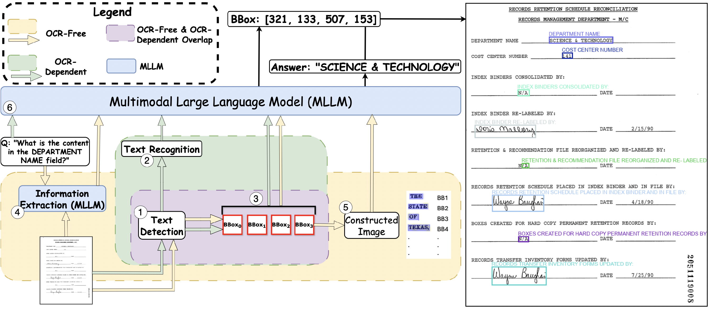
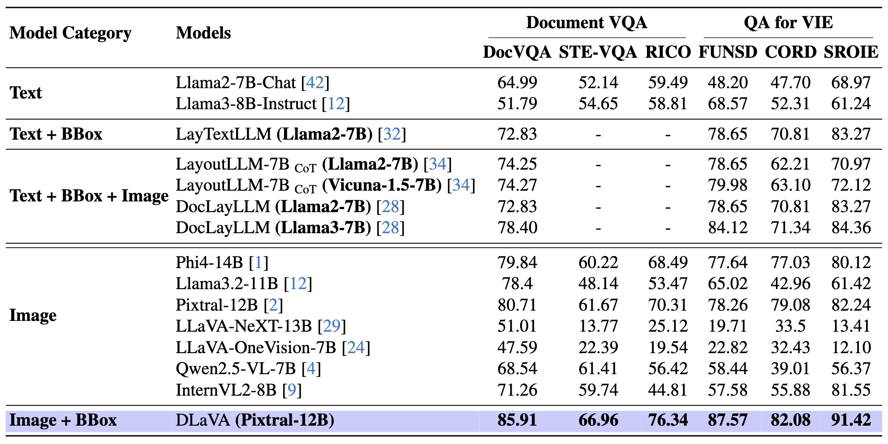
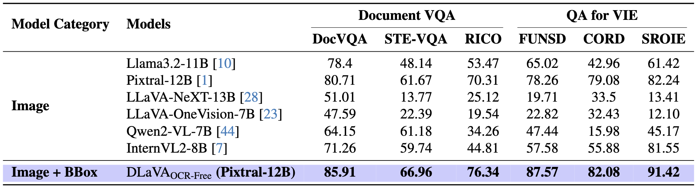

# DLaVA: Document Language and Vision Assistant

A framework for answer localization in Document Visual Question Answering (VQA) with enhanced interpretability and trustworthiness. The system integrates OCR-dependent and OCR-free methods to localize answers precisely within document images.

---

## Overview

DLaVA introduces a novel approach for Document VQA by:
- Incorporating answer localization to enhance user trust and model interpretability.
- Supporting both OCR-dependent and OCR-free pipelines.
- Achieving state-of-the-art (SOTA) performance on Document VQA and Visual Information Extraction (VIE) tasks.

  
*Figure 1: Examples of visual information extraction on images from the CORD dataset: questions are displayed at the top
in colored fonts, with the corresponding answers highlighted by matching colored boundary boxes.*

  
*Figure 2: DLaVA Model Architecture. This diagram illustrates our final single-pipeline design. In the text detection step, detected text regions generate two outputs: a series of cropped images that are reorganized into a “constructed image” with unique bounding box identifiers (e.g., BB1, BB2, BB3, etc.) and their corresponding bounding box coordinates (e.g., BB1 [10, 10, 60, 30], BB2 [70, 10, 140, 30], etc.). The approach then leverages a two-stage MLLM pipeline. In Stage 1, the original image and the user’s question are provided to the MLLM to derive an initial textual answer. In Stage 2, the constructed image—comprising all cropped images with their BB IDs—along with the recorded bounding box coordinates and the initial QA pair are fed back into the MLLM to refine spatial localization. This integrated design eliminates the need for iterative OCR and reduces computational overhead, culminating in a final annotation module that delivers the final answer along with precise bounding box annotations.* 

---

## Key Features

1. **Interpretability**: Annotates document images with bounding boxes for precise answer localization.
2. **Flexibility**: Supports OCR-dependent and OCR-free pipelines.
3. **Efficiency**: Streamlined processing without complex pretraining requirements.

---

## Setup

### Dependencies

To run the project, install the required dependencies based on the models:

- **For Pixtral, Qwen, and LLaVA models**:
  ```bash
  pip install -r requirements-i.txt
  ```
 - **For InternVL and LLaMA models**:
  ```bash
  pip install -r requirements-p.txt
  ```
---

## Configuration

To configure the project, create a file named `config.json` in the root directory. The file should contain your Hugging Face token for accessing pretrained models. Here’s an example structure:

```json
{
  "huggingface_token": "your_token_here"
}
```

Replace "your_token_here" with your actual Hugging Face token.

---

## Project Structure

The repository is organized as follows:

```plaintext
DLaVA/
├── ocr_free/             # Contains scripts for the OCR-free pipeline
│   ├── run.py            # Main script to execute OCR-free tasks
│   └── ...
├── ocr_dependent/        # Contains scripts for the OCR-dependent pipeline
│   ├── run.py            # Main script to execute OCR-dependent tasks
│   └── ...
├── models/               # Pretrained vision-language models
├── datasets/             # Scripts for dataset preprocessing and loading
├── evaluation/           # Scripts for model evaluation and metrics calculation
├── requirements-i.txt    # Dependencies for Pixtral, Qwen, and LLaVA models
├── requirements-p.txt    # Dependencies for InternVL and LLaMA models
└── README.md             # Project documentation


```

## Usage

### OCR-Free Approach

Run the OCR-free pipeline using the following command:
```bash
python ocr_free/master.py
```

### OCR-Dependent Approach

Run the OCR-dependent pipeline using the following command:
```bash
python ocr_dependent/master.py 
```

### Command-Line Arguments

Both the OCR-free and OCR-dependent pipelines support additional command-line arguments for customization:

- `--model`: Specify the model to use (e.g., `Pixtral`, `InternVL`).
- `--dataset`: Specify the dataset to process (e.g., `CORD`, `FUNSD`).
- `--output_dir`: Directory where the results will be saved.

#### Example Usage

To run the OCR-dependent pipeline with the Pixtral model on the CORD dataset and save results to a specific directory:
```bash
python ocr_dependent/master.py --config config.json --model Pixtral --dataset CORD --output_dir ./results/
```


## Evaluation

Evaluate the performance of DLaVA using the provided evaluation scripts. The framework supports two key metrics:

1. **Textual Accuracy**: Measured using the Average Normalized Levenshtein Similarity (ANLS).
2. **Spatial Alignment**: Measured using Intersection over Union (IoU) for bounding box accuracy.


## Running Evaluation

To evaluate model performance, run:
```bash
python ocr-free/mAP@IOU.py
```
or 
```bash
python ocr-dependent/mAP@IOU.py
```

---

## Performance

###

  
*Table 1: Comparison of DLaVA with SoTA models on benchmark datasets using ANLS evaluation metric*

### OCR-Free Results (ANLS Metric)

  
*Table 2: OCR-Free Results (ANLS Metric)*

---

## Supported Datasets

The DLaVA framework supports and has been tested on the following datasets:

1. **CORD**: Consolidated receipt dataset for structured information extraction.
2. **FUNSD**: Form Understanding in Noisy Scanned Documents.
3. **SROIE**: Scanned Receipt OCR and Information Extraction dataset.
4. **DocVQA**: Dataset for Document Visual Question Answering.

---

## Limitations and Future Work

### Limitations

- **IoU Challenges**: Low IoU scores for complex document layouts with overlapping elements.
- **Ambiguities**: Difficulty in resolving repeated values across fields, such as totals in receipts.

### Future Work

- **Fine-Tuning**: Improve bounding box annotations using techniques like LoRA.
- **Enhanced Reasoning**: Add spatial reasoning with positional priors and cross-field dependencies.
- **Extension**: Expand support to handle charts and graphical elements in documents.


