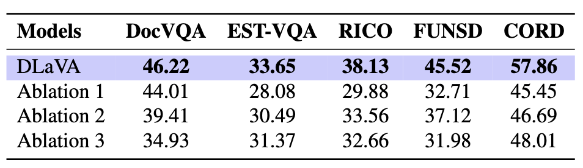

# DLaVA: Document Language and Vision Assistant

DLaVA is a cutting-edge framework for answer localization in Document Visual Question Answering (VQA). It is designed to enhance interpretability, trustworthiness, and efficiency in document understanding by directly linking answers to their spatial locations in images. Leveraging state-of-the-art Multimodal Large Language Models (MLLMs) and an innovative OCR-free “constructed image” approach, DLaVA achieves robust performance while minimizing computational overhead.

---

## Overview

Document VQA requires not only accurate textual extraction from complex layouts but also precise spatial reasoning to map answers onto document regions. DLaVA addresses these challenges by:
- Zero-Shot Answer Localization: A training-free, zero-shot pipeline that directly localizes answers.
- Constructed Image Strategy: Detected text regions are reorganized into a single image, where each cropped region is tagged with a unique bounding box ID, preserving spatial context.
- Dual Pipeline Support: Offers both OCR-free and OCR-dependent processing paths to suit different application needs.
- Enhanced Interpretability & Trustworthiness: Outputs include bounding box annotations that allow users to verify responses directly against the document.
- State-of-the-Art Performance: Achieves high accuracy on benchmarks such as DocVQA, STE-VQA, FUNSD, CORD, and SROIE, with evaluation based on both textual (ANLS) and spatial (IoU) metrics.

  
*Figure 1: Examples of visual information extraction on images from the CORD dataset: questions are displayed at the top
in colored fonts, with the corresponding answers highlighted by matching colored boundary boxes.*

  
*Figure 2: DLaVA Model Architecture. This diagram illustrates our final single-pipeline design. In the text detection step, detected text regions generate two outputs: a series of cropped images that are reorganized into a “constructed image” with unique bounding box identifiers (e.g., BB1, BB2, BB3, etc.) and their corresponding bounding box coordinates (e.g., BB1 [10, 10, 60, 30], BB2 [70, 10, 140, 30], etc.). The approach then leverages a two-stage MLLM pipeline. In Stage 1, the original image and the user’s question are provided to the MLLM to derive an initial textual answer. In Stage 2, the constructed image—comprising all cropped images with their BB IDs—along with the recorded bounding box coordinates and the initial QA pair are fed back into the MLLM to refine spatial localization. This integrated design eliminates the need for iterative OCR and reduces computational overhead, culminating in a final annotation module that delivers the final answer along with precise bounding box annotations.* 

---

## Key Features

1. **Interpretability & Trust**: Precise bounding box annotations map each answer to its location, reducing the risk of AI hallucinations.
2. **Flexibility**: Supports both OCR-free and OCR-dependent pipelines for various document types.
3. **Efficiency**: Eliminates iterative OCR, lowering token overhead and speeding up processing.
4. **Robust Performance**: Demonstrates competitive or superior results on benchmark datasets, validated by both Average Normalized Levenshtein Similarity (ANLS) and Intersection over Union (IoU) metrics.

---

## Architecture

DLaVA operates via a two-stage MLLM pipeline:
1. **Text Detection & Constructed Image Creation:**
- A text detection module (e.g., using DB-ResNet-50) identifies text regions and outputs bounding boxes.
- Cropped text images are rearranged into a “constructed image” with unique bounding box IDs and associated coordinates.

2. **Information Extraction & Localization:**
- Stage 1: The original document image and a user query are processed by an MLLM (e.g., Pixtral-12B) to generate an initial answer.
- Stage 2: The constructed image, together with bounding box coordinates and the initial QA pair, is fed back into the MLLM to refine the answer’s spatial localization.

This integrated design bypasses conventional OCR processing, reducing error propagation and computational cost.

--

## Setup

### Dependencies

To run the project, install the required dependencies based on the models:

- **For Pixtral, Qwen, and LLaVA models**:
  ```bash
  pip install -r requirements-i.txt
  ```
 - **For InternVL and LLaMA models**:
  ```bash
  pip install -r requirements-p.txt
  ```
---

## Configuration

To configure the project, create a file named `config.json` in the root directory. The file should contain your Hugging Face token for accessing pretrained models. Here’s an example structure:

```json
{
  "huggingface_token": "your_token_here"
}
```

Replace "your_token_here" with your actual Hugging Face token.

---

## Project Structure

The repository is organized as follows:

```plaintext
DLaVA/
├── ocr_free/             # Contains scripts for the OCR-free pipeline
│   ├── run.py            # Main script to execute OCR-free tasks
│   └── ...
├── ocr_dependent/        # Contains scripts for the OCR-dependent pipeline
│   ├── run.py            # Main script to execute OCR-dependent tasks
│   └── ...
├── models/               # Pretrained vision-language models
├── datasets/             # Scripts for dataset preprocessing and loading
├── evaluation/           # Scripts for model evaluation and metrics calculation
├── requirements-i.txt    # Dependencies for Pixtral, Qwen, and LLaVA models
├── requirements-p.txt    # Dependencies for InternVL and LLaMA models
└── README.md             # Project documentation


```

## Usage

### OCR-Free Approach

Run the OCR-free pipeline using the following command:
```bash
python ocr_free/master.py
```

### OCR-Dependent Approach

Run the OCR-dependent pipeline using the following command:
```bash
python ocr_dependent/master.py 
```

### Command-Line Arguments

Both the OCR-free and OCR-dependent pipelines support additional command-line arguments for customization:

- `--model`: Specify the model to use (e.g., `Pixtral`, `InternVL`).
- `--dataset`: Specify the dataset to process (e.g., `CORD`, `FUNSD`).
- `--output_dir`: Directory where the results will be saved.

#### Example Usage

To run the OCR-dependent pipeline with the Pixtral model on the CORD dataset and save results to a specific directory:
```bash
python ocr_dependent/master.py --config config.json --model Pixtral --dataset CORD --output_dir ./results/
```


## Evaluation

Evaluate the performance of DLaVA using the provided evaluation scripts. The framework supports two key metrics:

1. **Textual Accuracy**: Measured using the Average Normalized Levenshtein Similarity (ANLS).
2. **Spatial Alignment**: Measured using Intersection over Union (IoU) for bounding box accuracy.


## Running Evaluation

To evaluate model performance, run:
```bash
python ocr-free/mAP@IOU.py
```
or 
```bash
python ocr-dependent/mAP@IOU.py
```

---

## Metrics
- **Textual Accuracy**: Average Normalized Levenshtein Similarity (ANLS) assesses text quality.
- **Spatial Alignment**: Intersection over Union (IoU) across thresholds (mAP@IoU[0.50:0.95]) evaluates the precision of bounding box localization.


---

## Performance

### Results (ANLS Metric)

  
*Table 1: Comparison of DLaVA with SoTA models on benchmark datasets using ANLS evaluation metric*

### Results (IoU Metric)

  
*Table 2: Comparison of DLaVA and its ablation variants using IoU (mAP@IOU[0.50:0.95]) metric on Document VQA and QA for VIE*


